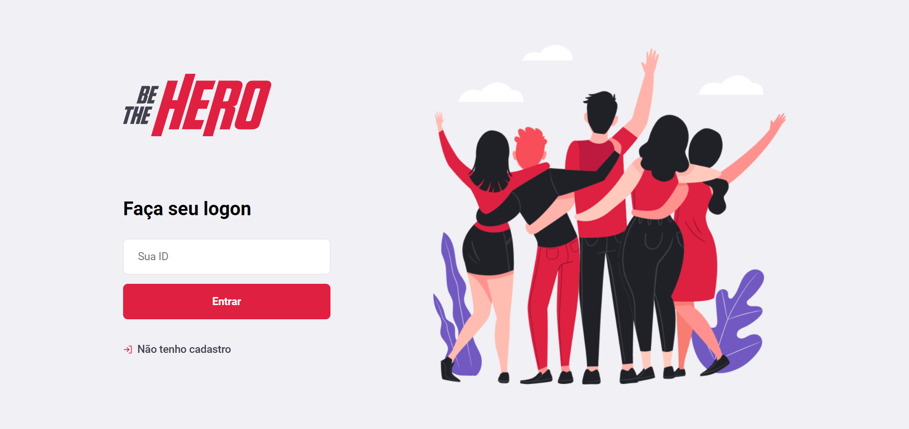
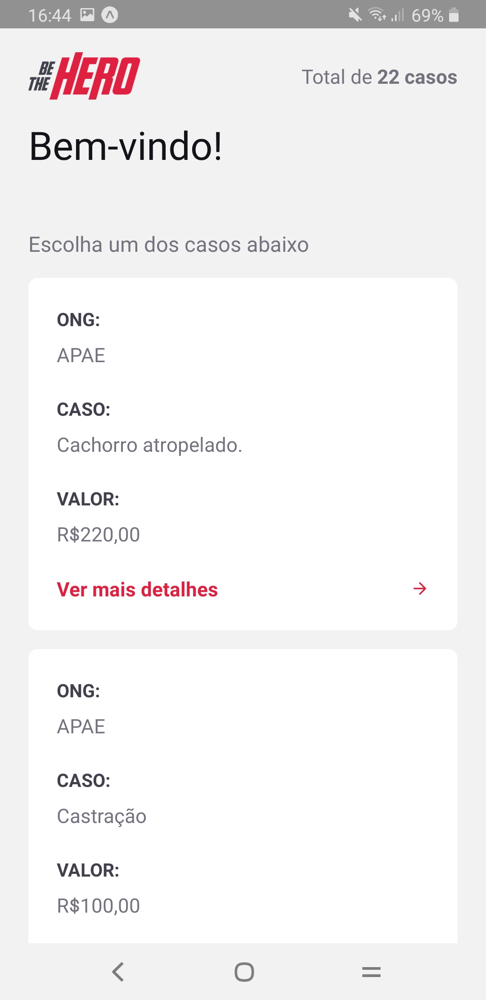
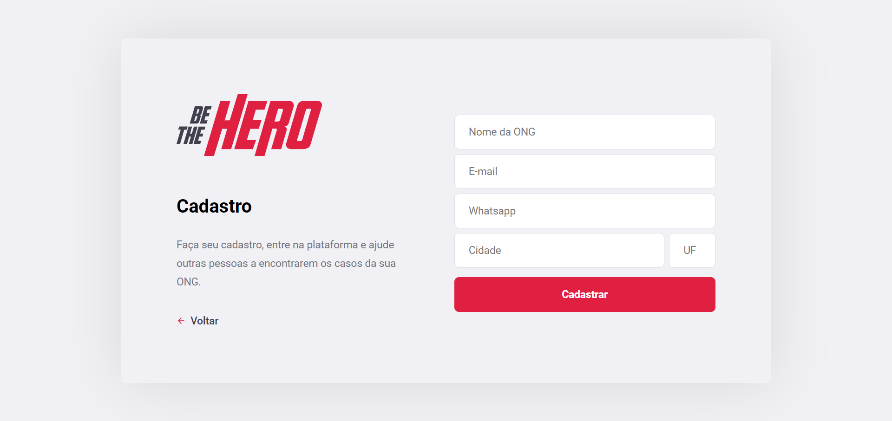
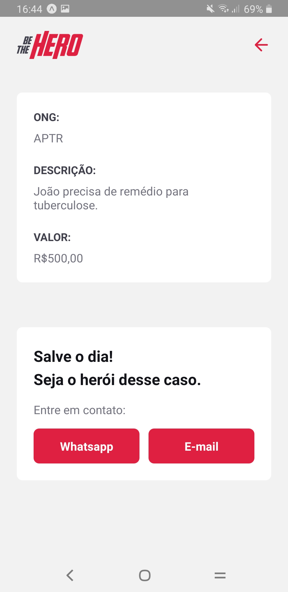
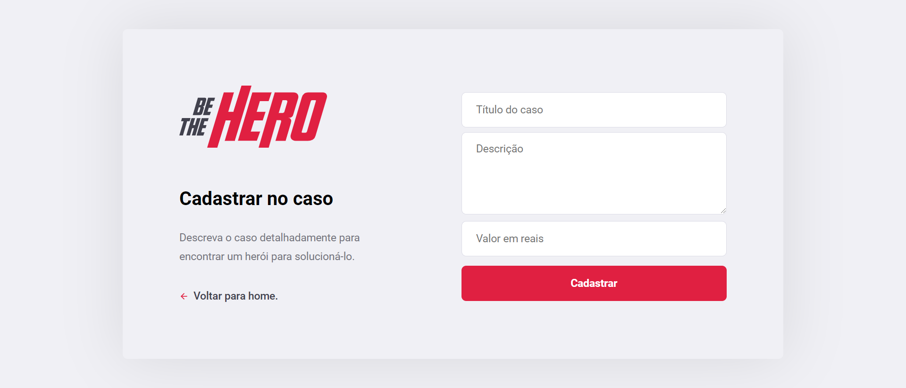
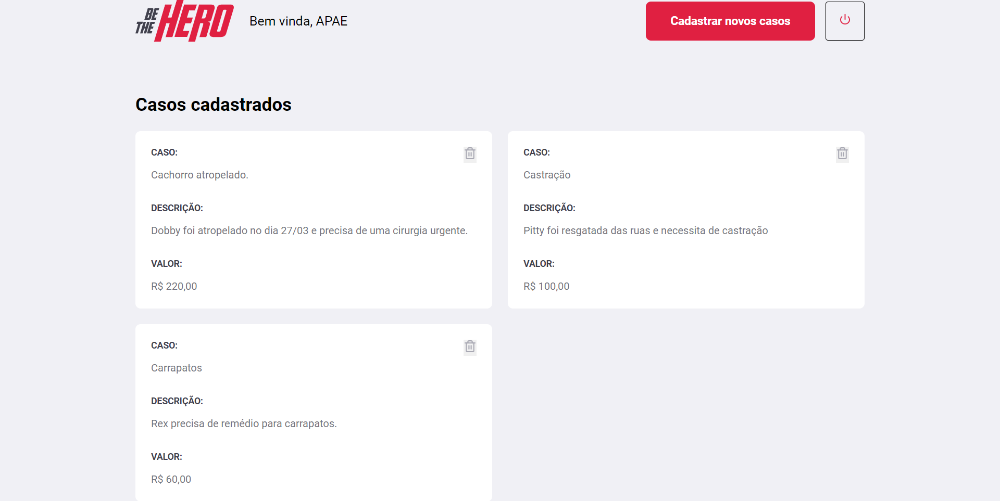

<p align="center">
  
</p>

## :file_folder: The Project
Project developed during the 11th OmniStack Week promoted by [Rocketseat](https://github.com/Rocketseat). **Be The Hero** allows Non-Governmental Organization to share their incidents and find interested on helping them. The software implements a web interface where each NGO may manage their incidents. The mobile app is created for the general user see the registered incidents and contact the organization via email or WhatsApp. The system works with an REST API on the Back-End that communicates with the Front-End and the SQL database.

## :rocket: Technologies
|   Back-End   |            Web  |    Mobile        |
| :---:        |     :---:       |        :---:     |
| Node.js      | ReactJS         | React Native     |
| SQLite       |                 | Expo             |
| Nodemon      |                 |                  |

## :camera: Screenshots:
|                           Web                              |                               Mobile                                   |
| :---:                                                      |                                                          :---:         |
| Login page           |List of Incidents|
| Register page|Details page         |
| Add Incident page|                                                                 |
| Incidents management  page|                                                             |

## :computer: Installation
### Running the **Back-End**:
Run the following commands:
```bash
cd backend
npm install
npm start
```
___
### Running the **Web Front-End**:
```bash
cd frontend
npm install
npm start
```
The web project will start running on `localhost:3000`.  
___
### Running the **Mobile App**:
Edit the `src/services/api.js` file using you Back-End server/computer IP:
```
import axios from 'axios';

const api = axios.create({
    baseURL: 'http://your-server-ip-goes-here:3333'
})
export default api;
```

```bash
cd mobile
npm start
```
You may now use an emulator or your physical device to test the app. You must download *Expo* app from Play Store or App Store then scan the generated QR code.
